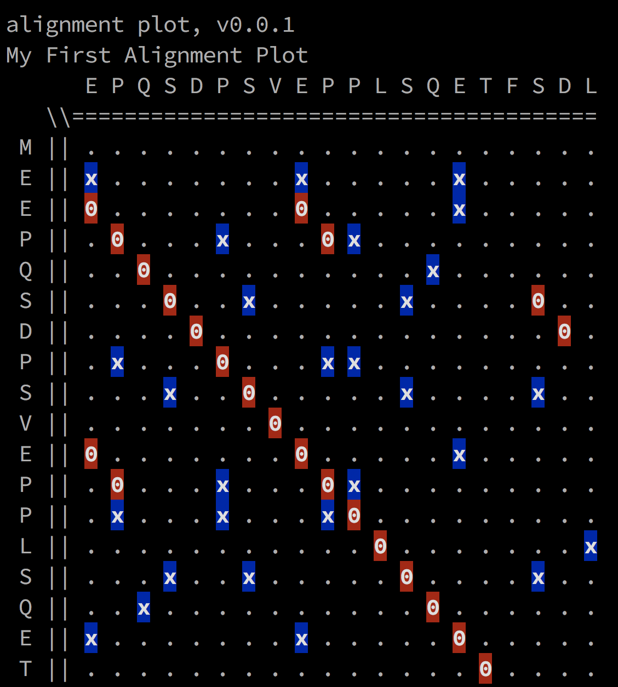

# Alignment Plots Package
Alignment plots visualize the relationship between nucleotide or amino acid sequences.

## Example

The following example demonstrates how to print an alignment plot of two sequences to `stdout`.

```go
package main

import (
	"fmt"
	"log"

	"github.com/DanielSchuette/bioinformatics/alignmentplots"
)

func main() {
	// create an `Alignment' struct
	align := &alignmentplots.Alignment{
		SeqA: "MEEPQSDPSVEPPLSQET",   /* human TP53 AA 1-18 */
		SeqB: "EPQSDPSVEPPLSQETFSDL", /* human TP53 AA 3 - 22 */
	}

	// plot the resulting struct
	fmt.Println(align)

	// align the two input sequences `SeqA' and `SeqB'
	align.Align()

	// plot the alignment
	err := align.Plot("My First Alignment Plot")
	if err != nil {
		log.Fatalf("error while plotting: %v\n", err)
	}
}
```

This program generates the following output:



Matching residues are represented by certain characters (`0` for matches that lie within the main diagonal or have at least one diagonal neighbor and `x` for matches that are not associated with a sequence of at least two diagonal matches) and are color-coded.


## License

The code in this repository is MIT licensed.
